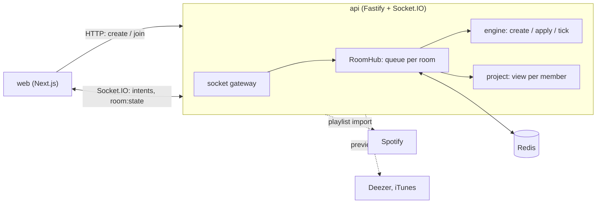

# Architecture

ResenhARK is a monorepo with three packages: `apps/api` (the server), `apps/web` (the interface) and `packages/shared` (the contracts both sides import). This page explains how the server keeps rooms and games consistent.

## The server is the authority

The web app holds no game logic. It sends intents ("draw", "lock this guess") and renders what the server sends back. The Hitline engine runs only on the server. `packages/shared` carries Zod schemas and types for intents, views and events, not the engine.

Every change follows the same path:

1. Load the room from Redis.
2. Run `tick` to settle any deadline that already passed.
3. Run the intent (`apply`).
4. Save the room to Redis. This is the commit boundary.
5. Send each connected member a `room:state` snapshot projected for that member.

The snapshot is the truth for the screen, and the events that come with it only trigger animations. A client that reconnects receives the current snapshot.

## One queue per room

`RoomHub.mutate` runs every change to a room through a promise queue held in memory, one queue per room code. Changes to the same room run one at a time, in order. Different rooms do not wait for each other.

Inside the queue, the `tick` runs before the intent. Time passing is not part of the intent, so the tick is saved even when the intent fails.

Two things stay outside the queue because they call the network: the Spotify playlist import and the audio preview lookup. After the import finishes, a short mutation stores the result. After a card is drawn, a lookup checks for a preview and, if none exists, a follow-up mutation drops the card.

A failed mutation does not block the next one in the queue.

## Redis keys

All room data expires 6 hours after the last activity. Each mutation renews the time to live (`touch`).

| Key | Type | Content | Expiry |
|---|---|---|---|
| `room:<code>` | string (JSON) | The whole room: members, lobby, played set, the game state including the hidden deck | 6 h, renewed |
| `chat:<code>` | list | The last 200 messages (`LPUSH` plus `LTRIM`) | 6 h, renewed |
| `session:<token>` | string (JSON) | `{ code, memberId }` | 6 h, renewed |
| `member-sessions:<code>:<memberId>` | set | Tokens of a member, to revoke them on kick or leave | 6 h, renewed |
| `draw:<drawId>` | string | The room code of a drawn card, so `/audio` can find it | 6 h |
| `admin:<token>` | string | A logged-in admin | 1 h |
| `oauth-state:<state>` | string | A pending Spotify authorization, single use | 10 min |
| `spotify:refresh` | string | The Spotify refresh token | none |

The room is one JSON document. The game state sits inside it, so a save stores the room and the game together.

## The Hitline engine

The engine in `apps/api/src/app/games/hitline/engine.ts` is made of pure functions. They take the clock (`now`), a random generator and an id generator as arguments, so tests control time and shuffling.

| Function | Job |
|---|---|
| `create(config, playerIds, deck, ctx)` | Builds the first state: shuffles the deck and the turn order, deals one card and 2 tokens per player |
| `apply(state, actorId, action, ctx)` | Applies one action and returns `{ ok, state, events }` or `{ ok: false, error }` with a rule error. It never mutates its input |
| `tick(state, ctx)` | Settles every deadline that has passed (contest, guess, offline turn player) and returns the new state and events |
| `project(state, viewerId)` | Returns what that viewer may see. See [Hidden information](hidden-information.md) |

Deadlines are absolute timestamps stored in the state. After each commit, the hub arms one `setTimeout` per room for the next deadline (`roomDeadline`, which also covers the owner handover). When it fires, it runs an empty mutation, so the `tick` runs inside the queue like everything else. A stale timer does nothing, because the tick decides from the state.

## The room and game boundary

The room module (`apps/api/src/app/domain/room`) knows members, ownership, chat and the lobby. It stores a game as `{ type, state, playerIds }` and never reads inside the state. The Hitline module (`games/hitline`) knows nothing about members or sockets.

`RoomHub` and `socket-gateway.ts` connect the two: they call `create`, `apply`, `tick` and `project`. A new game, such as SiteSpy or Codetalk, would add its own folder next to `hitline` with the same four functions. The formal `Game` interface is not extracted yet. The plan is to extract it once a second real game exists. `RoomView.game` and `GameEvent` in `packages/shared` are the types to widen at that point.

## Presence and ownership

A member is online while at least one socket is connected. The gateway counts connections up on connect and down on disconnect. A player who goes offline stays in the game. The engine marks them offline and applies the 30 second rule from [Hitline rules](../reference/hitline-rules.md).

If the owner stays offline for 60 seconds, the room passes to the next online member by join order. The tick does this and posts a system message.

## Recovery after a crash

The server keeps only timers and queues in memory. At boot, before it listens, `RoomHub.rehydrate()` goes through every `room:*` key:

1. It sets every member offline, because connection counts saved before a crash are ghosts. The first real connection flips a member back online.
2. It marks every player of a running game offline in the engine.
3. It arms each room's timer.

Rooms and games continue where they were. Deadlines that passed during the downtime are settled by the first tick. One room that fails to load does not stop the boot. Clients reconnect on their own with their session token and receive the current snapshot.

## Hosting shape

The API is one stateful process. Redis is the source of truth. The process keeps only the per-room queues, the timers, and the rate limiter counters. See [Known limits](known-limits.md) for what that rules out.
